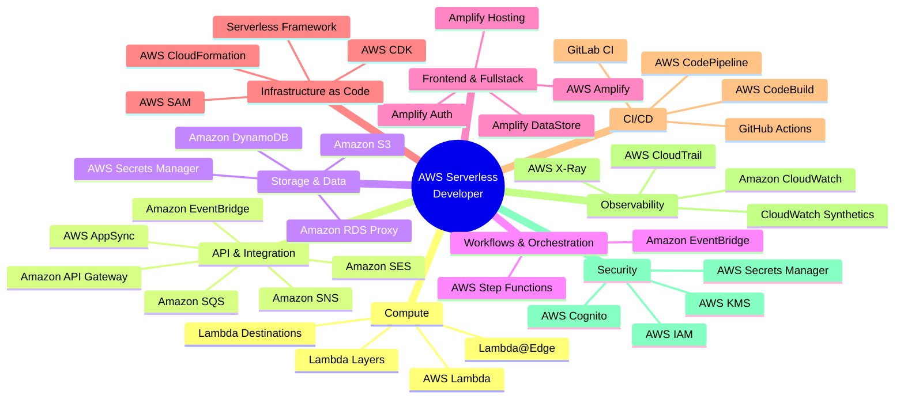
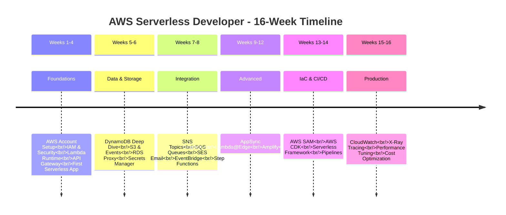

# AWS Serverless Developer - Roadmap Diagram

```mermaid
flowchart TD
    Start([Start: Developer New to Serverless]) --> Phase1[Phase 1: Serverless Foundations<br/>Weeks 1-4]
    
    subgraph Phase1[Phase 1: Serverless Foundations<br/>Weeks 1-4]
        direction TB
        A1[AWS Account Setup<br/>IAM, Organizations, Budgets]
        A2[Lambda Deep Dive<br/>Runtime, Handler, Layers, Concurrency]
        A3[API Gateway<br/>REST APIs, HTTP APIs, Stages, CORS]
        A4[First Serverless App<br/>Hello World Lambda + API Gateway]
    end
    
    Phase1 --> Phase2[Phase 2: Data & Storage<br/>Weeks 5-6]
    
    subgraph Phase2[Phase 2: Data & Storage<br/>Weeks 5-6]
        direction TB
        B1[DynamoDB<br/>Tables, Partitions, GSI, Transactions]
        B2[S3<br/>Buckets, Objects, Versioning, Events]
        B3[RDS Proxy<br/>Serverless Database Connections]
        B4[Secrets Manager<br/>Credentials, Rotation]
    end
    
    Phase2 --> Phase3[Phase 3: Integration & Messaging<br/>Weeks 7-8]
    
    subgraph Phase3[Phase 3: Integration & Messaging<br/>Weeks 7-8]
        direction TB
        C1[SNS<br/>Topics, Subscriptions, FIFO]
        C2[SQS<br/>Queues, DLQ, Visibility Timeout]
        C3[SES<br/>Emails, Templates, Configurations]
        C4[EventBridge<br/>Event Buses, Rules, Schema Registry]
        C5[Step Functions<br/>State Machines, Express, Errors]
    end
    
    Phase3 --> Phase4[Phase 4: Advanced Serverless<br/>Weeks 9-12]
    
    subgraph Phase4[Phase 4: Advanced Serverless<br/>Weeks 9-12]
        direction TB
        D1[AppSync<br/>GraphQL APIs, Resolvers, Data Sources]
        D2[Lambda@Edge<br/>CloudFront Functions, Viewer/Origin]
        D3[S3 Select & Glacier<br/>Query Objects, Archive Storage]
        D4[Amplify<br/>Fullstack Serverless, Hosting, Auth]
        D5[Serverless Frameworks<br/>SAM vs CDK vs Serverless Framework]
    end
    
    Phase4 --> Phase5[Phase 5: IaC & CI/CD<br/>Weeks 13-14]
    
    subgraph Phase5[Phase 5: IaC & CI/CD<br/>Weeks 13-14]
        direction TB
        E1[AWS SAM<br/>Templates, Commands, Local Testing]
        E2[AWS CDK<br/>Constructs, Stacks, Pipelines]
        E3[Serverless Framework<br/>Config, Plugins, Stages]
        E4[CI/CD Pipelines<br/>GitHub Actions, GitLab CI, CodePipeline]
    end
    
    Phase5 --> Phase6[Phase 6: Observability & Production<br/>Weeks 15-16]
    
    subgraph Phase6[Phase 6: Observability & Production<br/>Weeks 15-16]
        direction TB
        F1[CloudWatch<br/>Metrics, Logs, Alarms, Dashboards]
        F2[X-Ray<br/>Traces, Service Map, Annotations]
        F3[Distributed Tracing<br/>Best Practices, Correlation IDs]
        F4[Performance & Cost<br/>Optimization, Right-sizing, Monitoring]
    end
    
    Phase6 --> End([End: AWS Serverless Developer<br/>Ready for Production])
    
    style Start fill:#4CAF50,color:#fff
    style End fill:#2196F3,color:#fff
    style Phase1 fill:#FF9800,color:#fff
    style Phase2 fill:#FF9800,color:#fff
    style Phase3 fill:#FF9800,color:#fff
    style Phase4 fill:#FF9800,color:#fff
    style Phase5 fill:#9C27B0,color:#fff
    style Phase6 fill:#9C27B0,color:#fff
```

---

## Technology Stack



---

## Service Dependency Map

```mermaid
flowchart LR
    subgraph Client[Client Applications]
        Web[Web App]
        Mobile[Mobile App]
        IoT[IoT Device]
    end
    
    subgraph Edge[Edge & API Layer]
        CF[CloudFront]
        APIGW[API Gateway]
        AppSync[AppSync]
        LambdaEdge[Lambda@Edge]
    end
    
    subgraph Compute[Compute Layer]
        Lambda[AWS Lambda]
        LambdaLayers[Lambda Layers]
    end
    
    subgraph Data[Data Layer]
        DDB[DynamoDB]
        S3[S3]
        RDS[RDS via Proxy]
        Secrets[Secrets Manager]
    end
    
    subgraph Integration[Integration Layer]
        SNS[SNS]
        SQS[SQS]
        SES[SES]
        EB[EventBridge]
        SF[Step Functions]
    end
    
    subgraph Observe[Observability Layer]
        CW[CloudWatch]
        XRay[X-Ray]
        CT[CloudTrail]
    end
    
    subgraph IaC[IaC Layer]
        SAM[AWS SAM]
        CDK[AWS CDK]
        SFW[Serverless Framework]
    end
    
    Web --> CF
    Mobile --> APIGW
    IoT --> EB
    
    CF --> LambdaEdge
    APIGW --> Lambda
    AppSync --> Lambda
    EB --> Lambda
    SNS --> Lambda
    SQS --> Lambda
    SF --> Lambda
    
    Lambda --> DDB
    Lambda --> S3
    Lambda --> RDS
    Lambda --> Secrets
    Lambda --> SNS
    Lambda --> SQS
    Lambda --> SES
    Lambda --> SF
    
    Lambda --> CW
    Lambda --> XRay
    
    SAM --> Lambda
    SAM --> APIGW
    SAM --> DDB
    CDK --> Lambda
    CDK --> APIGW
    CDK --> DDB
    SFW --> Lambda
    SFW --> APIGW
```

---

## Phase Timeline



---

## Role Focus Areas

```mermaid
graph TB
    subgraph Serverless[Full-Stack Serverless Developer]
        direction TB
        
        subgraph Compute[Serverless Compute]
            Lambda[AWS Lambda]
            Layers[Lambda Layers]
            Edge[Lambda@Edge]
            Dest[Lambda Destinations]
        end
        
        subgraph API[API & Integration]
            APIGW[API Gateway]
            AppSync[AppSync]
            EventBridge[EventBridge]
            SNS[SNS]
            SQS[SQS]
            SES[SES]
        end
        
        subgraph Data[Data & Storage]
            DynamoDB[DynamoDB]
            S3[S3]
            RDS[RDS Proxy]
            Secrets[Secrets Manager]
        end
        
        subgraph Workflow[Orchestration]
            SF[Step Functions]
            Express[Express Workflows]
            Map[Map States]
        end
        
        subgraph Frontend[Fullstack Serverless]
            Amplify[Amplify]
            Hosting[Amplify Hosting]
            Auth[Cognito Auth]
            DataStore[DataStore]
        end
        
        subgraph IaC[Infrastructure as Code]
            SAM[AWS SAM]
            CDK[AWS CDK]
            ServerlessFW[Serverless Framework]
        end
        
        subgraph DevOps[CI/CD & Ops]
            CodePipeline[CodePipeline]
            Actions[GitHub Actions]
            CloudWatch[CloudWatch]
            XRay[X-Ray]
        end
    end
    
    Compute --> API
    API --> Data
    API --> Workflow
    Data --> Compute
    Workflow --> Compute
    Frontend --> API
    API --> Frontend
    IaC --> Compute
    IaC --> API
    IaC --> Data
    IaC --> Workflow
    DevOps --> IaC
    DevOps --> Compute
    
    style Serverless fill:#FF9900,color:#fff
    style Compute fill:#FF9900,color:#fff
    style API fill:#FF9900,color:#fff
    style Data fill:#FF9900,color:#fff
    style IaC fill:#232F3E,color:#fff
    style DevOps fill:#232F3E,color:#fff
```

---

## How to Use These Diagrams

### In GitHub/GitLab
These Mermaid diagrams render automatically in Markdown files.

### In VS Code
Install the [Markdown Preview Mermaid](https://marketplace.visualstudio.com/items?itemName=bierner.markdown-mermaid) extension.

### Export as Image
Use the [Mermaid CLI](https://github.com/mermaid-js/mermaid-cli):
```bash
npx @mermaid-js/mermaid-cli mmdc -i roadmap-diagram.md -o roadmap.png
```

### Edit Diagrams
Use the [Mermaid Live Editor](https://mermaid.live) for interactive editing.

---

## Continue To

- **[README.md](./README.md)** — AWS Serverless Developer roadmap overview
- **[02-roadmap.md](../docs/02-roadmap.md)** — Full 33-week AWS Cloud Engineer roadmap
- **[03-learning-path.md](../docs/03-learning-path.md)** — Detailed week-by-week curriculum
