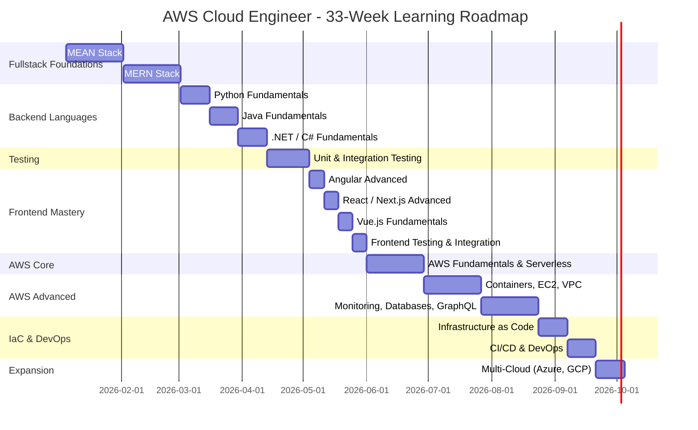
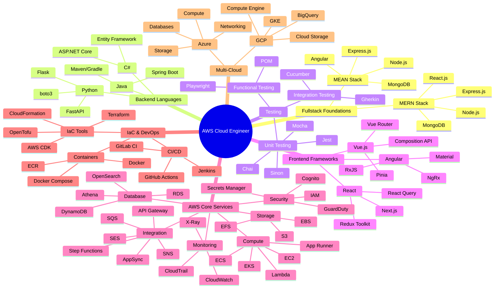
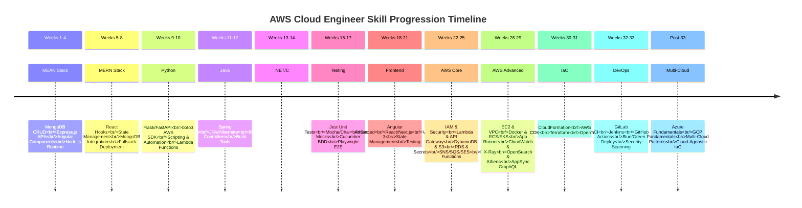
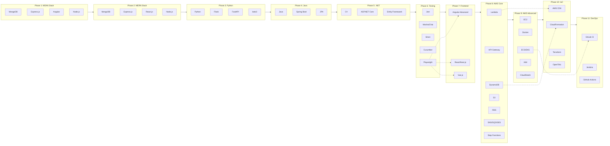
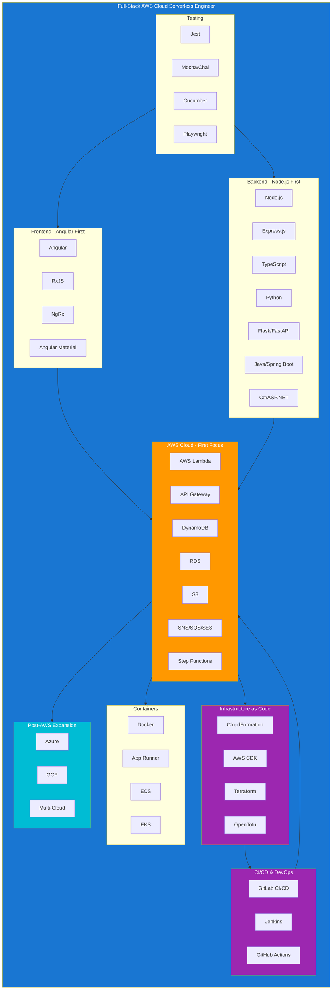

# AWS Cloud Engineer - Learning Roadmap Diagrams

This document contains visual diagrams for the 33-week learning roadmap. These diagrams render natively in GitHub, GitLab, and most Markdown viewers.

---

## Learning Path Flowchart

```mermaid
flowchart TD
    Start([Start: Fresher with No Programming Background]) --> Phase1[Phase 1: MEAN Stack<br/>Weeks 1-4<br/>MongoDB, Express.js, Angular, Node.js]
    
    Phase1 --> Phase2[Phase 2: MERN Stack<br/>Weeks 5-8<br/>MongoDB, Express.js, React.js, Node.js]
    
    Phase2 --> Phase3[Phase 3: Python Fundamentals<br/>Weeks 9-10<br/>Python, Flask, FastAPI]
    
    Phase3 --> Phase4[Phase 4: Java Fundamentals<br/>Weeks 11-12<br/>Java, Spring Boot]
    
    Phase4 --> Phase5[Phase 5: .NET / C# Fundamentals<br/>Weeks 13-14<br/>C#, ASP.NET Core]
    
    Phase5 --> Phase6[Phase 6: Testing Fundamentals<br/>Weeks 15-17<br/>Jest, Mocha, Chai, Sinon, Cucumber, Playwright]
    
    Phase6 --> Phase7[Phase 7: Frontend Development<br/>Weeks 18-21<br/>Angular, React/Next.js, Vue.js]
    
    Phase7 --> Phase8[Phase 8: AWS Fundamentals & Serverless<br/>Weeks 22-25<br/>Lambda, API Gateway, DynamoDB, S3, RDS, SNS, SQS, SES, Step Functions]
    
    Phase8 --> Phase9[Phase 9: AWS Advanced Services<br/>Weeks 26-29<br/>EC2, Docker, App Runner, ECS, EKS, IAM, CloudWatch, X-Ray, OpenSearch, Athena]
    
    Phase9 --> Phase10[Phase 10: Infrastructure as Code<br/>Weeks 30-31<br/>CloudFormation, AWS CDK, Terraform, OpenTofu]
    
    Phase10 --> Phase11[Phase 11: CI/CD & DevOps<br/>Weeks 32-33<br/>GitLab CI/CD, Jenkins, GitHub Actions]
    
    Phase11 --> MultiCloud[Multi-Cloud Expansion<br/>Post-AWS Mastery<br/>Azure, GCP, Multi-Cloud Architecture]
    
    MultiCloud --> End([End: Full-Stack AWS Cloud Serverless Engineer<br/>Ready for Production Delivery])
    
    style Start fill:#4CAF50,color:#fff
    style End fill:#2196F3,color:#fff
    style Phase8 fill:#FF9800,color:#fff
    style Phase9 fill:#FF9800,color:#fff
    style Phase10 fill:#9C27B0,color:#fff
    style Phase11 fill:#9C27B0,color:#fff
    style MultiCloud fill:#00BCD4,color:#fff
```



---

## 33-Week Timeline Gantt Chart



---

## Technology Stack Mindmap



---

## Skill Progression Timeline



---

## Phase Dependency Graph



---

## Role Focus Areas



---

## How to Use These Diagrams

### In GitHub/GitLab
These Mermaid diagrams render automatically in Markdown files on GitHub and GitLab.

### In VS Code
Install the [Markdown Preview Mermaid](https://marketplace.visualstudio.com/items?itemName=bierner.markdown-mermaid) extension to preview diagrams.

### Export as Image
Use the [Mermaid CLI](https://github.com/mermaid-js/mermaid-cli) to export diagrams:
```bash
npx @mermaid-js/mermaid-cli mmdc -i diagram-file.md -o output.png
```

### Edit Diagrams
Use the [Mermaid Live Editor](https://mermaid.live) for interactive editing.

---

## Continue To

- **[02-roadmap](./02-roadmap.html)** — 33-week structured learning roadmap
- **[03-learning-path](./03-learning-path.html)** — Detailed week-by-week curriculum with objectives and deliverables
- **[01-role-description](./01-role-description.html)** — Role responsibilities and success criteria
